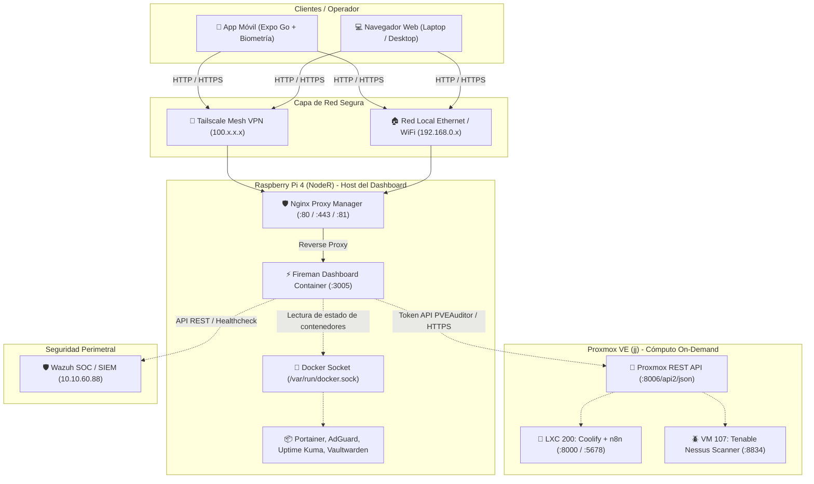

# ⚡ NodeR · Fireman Dashboard & SOC/NOC Ecosystem

Centro de comando, telemetría y observabilidad unificada para el Homelab y entorno **Fireman**. Este sistema integra el nodo perimetral de bajo consumo **Raspberry Pi 4 (`NodeR`)** con el hipervisor de alto rendimiento **Proxmox VE (`jj`)**, el centro de operaciones de seguridad **Wazuh SOC** y el escáner de vulnerabilidades **Tenable Nessus**.

---

## 🌐 ¿Cómo se conectan el Dashboard, Proxmox y la Raspberry Pi?

El ecosistema opera mediante una arquitectura de capas bien delimitada (Red / Datos / Presentación) para garantizar seguridad, bajo consumo y accesibilidad tanto remota como local:



### 1. Conexión Cliente ➔ Dashboard (Acceso de Usuario)
* **Vía Red Local**: Desde tu red hogareña, navegás a `http://192.168.0.200:3005` o mediante el proxy SSL configurado en NPM (ej. `https://fireman.local`).
* **Vía Remota (Tailscale)**: Desde cualquier lugar del mundo conectado a tu red Tailscale, entrás directo a `http://100.120.34.14:3005` sin necesidad de abrir puertos hacia internet en tu router.

### 2. Conexión Dashboard ➔ Raspberry Pi (`NodeR`)
* El dashboard corre como un contenedor Docker en la misma Pi.
* Para leer métricas de hardware (CPU, RAM, temperatura) y el estado de los demás contenedores (AdGuard, Vaultwarden, NPM, etc.), tiene montado el socket local `/var/run/docker.sock:ro` en modo solo lectura.

### 3. Conexión Dashboard ➔ Proxmox VE (`jj`)
* **Canal**: Se comunica vía HTTPS por la IP de Tailscale `https://100.77.123.25:8006` o la IP local `https://192.168.0.104:8006`.
* **Seguridad (Principio de Mínimo Privilegio)**: No se usa la contraseña de root. Se utiliza un **API Token** asignado a un usuario sin privilegios administrativos (`homepage-monitor@pve` con rol `PVEAuditor`). El token solo puede consultar estadísticas de CPU, RAM, estado de VMs y LXCs, sin permisos para apagar ni modificar nada.

---

## 📋 Guía de Inicio Rápido: Paso a Paso

### Paso 1: Configurar el Token de Monitoreo en Proxmox (`jj`)

Conectate por SSH a Proxmox:
```bash
ssh root@100.77.123.25
```

Ejecutá los siguientes comandos para crear el usuario de monitoreo de solo lectura y generar su API Token:

```bash
# 1. Crear el usuario en el realm de PVE
pveum user add homepage-monitor@pve --comment "Usuario solo lectura para Dashboard"

# 2. Asignarle el rol PVEAuditor (solo auditoría/lectura de métricas en todo el hipervisor)
pveum acl modify / --roles PVEAuditor --users homepage-monitor@pve

# 3. Generar el API Token (privsep 0 para heredar permisos del usuario)
pveum user token add homepage-monitor@pve fireman-token --privsep 0 --comment "API Token para Fireman Dashboard"
```

> ⚠️ **Guarda el `value` (secreto)** que te devuelva la terminal, ya que Proxmox solo lo muestra una única vez.

---

### Paso 2: Desplegar el Dashboard en la Raspberry Pi (`NodeR`)

Tenés **dos opciones** listas para correr en la Pi:

#### 🌟 Opción A: Web Dedicada (Diseño Idéntico al Mockup)

1. Conectate por SSH a la Raspberry Pi:
   ```bash
   ssh admin@100.120.34.14
   ```
2. Cloná o sincronizá la carpeta del proyecto en la Pi:
   ```bash
   cd /home/admin
   git clone https://github.com/BaXoMs/Home-Page-Server.git dashboard
   cd dashboard
   ```
3. Construí y levantá el contenedor:
   ```bash
   docker compose up -d --build
   ```
4. Verificá que esté corriendo:
   ```bash
   docker ps | grep fireman-dashboard
   ```
   *Acceso web inmediato*: `http://100.120.34.14:3005` o `http://192.168.0.200:3005`.

---

#### 📦 Opción B: Suite Comunitaria `gethomepage`

Si preferís la versión basada en archivos YAML de gethomepage:
```bash
cd /home/admin/dashboard/homepage-yaml
docker compose up -d
```
Los archivos de configuración quedan en `/home/admin/dashboard/homepage-yaml/config/` (`services.yaml`, `widgets.yaml`, etc.).

---

### Paso 3: Mapear el Dominio y SSL en Nginx Proxy Manager (Opcional)

Para que el acceso sea por HTTPS limpio (sin advertencias de certificado ni escribir el puerto `:3005`):

1. Entrá al panel de NPM en la Pi: `http://100.120.34.14:81`
2. Andá a **Hosts** ➔ **Proxy Hosts** ➔ **Add Proxy Host**:
   * **Domain Names**: `fireman.local` o tu subdominio de Tailscale/DuckDNS.
   * **Scheme**: `http`
   * **Forward Hostname / IP**: `192.168.0.200` (o `127.0.0.1`)
   * **Forward Port**: `3005`
   * Marcá: *Block Common Exploits* y *Websockets Support*.
3. En la pestaña **SSL**:
   * Seleccioná tu certificado o generá uno nuevo con Let's Encrypt / Tailscale.
   * Marcá: *Force SSL* y *HTTP/2 Support*.

---

### Paso 4: Iniciar y Usar la App Móvil con Expo Go

La aplicación móvil se encuentra en la carpeta `fireman-dashboard-mobile/`.

1. En tu máquina de desarrollo, entrá a la carpeta del proyecto móvil:
   ```bash
   cd fireman-dashboard-mobile
   ```
2. Instalá las dependencias (solo la primera vez):
   ```bash
   npm install
   ```
3. Iniciá el servidor de desarrollo de Expo:
   ```bash
   npx expo start
   ```
4. **Abrir en tu teléfono**:
   * En **Android**: Abrí la aplicación **Expo Go** y escaneá el código QR que se dibuja en la terminal.
   * En **iOS**: Abrí la app de la **Cámara**, enfocá el código QR y tocá la notificación para abrirlo en **Expo Go**.
5. **Autenticación Biométrica**:
   * Al abrir la app, te solicitará desbloquear con tu huella digital o Face ID.
   * Una vez autenticado, cargará la interfaz a pantalla completa.
   * Podés usar el botón de ajustes (engranaje arriba a la derecha) para cambiar entre la IP de Tailscale y la IP de Red Local con un solo toque.
   * Deslizá hacia abajo en cualquier momento (**Pull-to-Refresh**) para refrescar la telemetría.

---

## 🛠️ Comandos de Mantenimiento y Verificación

### Ver logs del Dashboard en la Pi:
```bash
docker logs -f fireman-dashboard
```

### Reiniciar el Dashboard:
```bash
docker compose restart
```

### Probar conectividad desde la Pi hacia Proxmox por Tailscale:
```bash
curl -k https://100.77.123.25:8006
```

### Probar conectividad hacia el dashboard local:
```bash
curl -I http://localhost:3005
```

---

## 🗺️ Mapa Completo de IPs y Puertos del Ecosistema

| Servicio | Host / Nodo | IP Tailscale | IP Red Local | Puerto | Protocolo |
| :--- | :--- | :--- | :--- | :--- | :--- |
| **Fireman Dashboard** | `NodeR` (Pi 4) | `100.120.34.14` | `192.168.0.200` | `:3005` | HTTP / Reverse Proxy |
| **Proxmox VE** | `jj` | `100.77.123.25` | `192.168.0.104` | `:8006` | HTTPS (API & Web UI) |
| **Coolify (LXC 200)** | `jj` | `100.120.169.85` | `192.168.0.112` | `:8000` | HTTP |
| **n8n Automation** | `jj` (LXC 200) | `100.120.169.85` | `192.168.0.112` | `:5678` | HTTP |
| **Portainer CE** | `NodeR` (Pi 4) | `100.120.34.14` | `192.168.0.200` | `:9000` | HTTP |
| **AdGuard Home** | `NodeR` (Pi 4) | `100.120.34.14` | `192.168.0.200` | `:3000` / `:53` | HTTP / DNS UDP/TCP |
| **Uptime Kuma** | `NodeR` (Pi 4) | `100.120.34.14` | `192.168.0.200` | `:3001` | HTTP |
| **Vaultwarden** | `NodeR` (Pi 4) | `100.120.34.14` | `192.168.0.200` | `:8080` / `:3012`| HTTP / WebSockets |
| **Nginx Proxy Mgr** | `NodeR` (Pi 4) | `100.120.34.14` | `192.168.0.200` | `:81` / `:80` / `:443` | HTTP / HTTPS Admin |
| **Wazuh SOC** | Core Net | — | `10.10.60.88` | `:443` | HTTPS |
| **Tenable Nessus** | `jj` (VM 107) | — | `10.10.60.88` | `:8834` | HTTPS |
